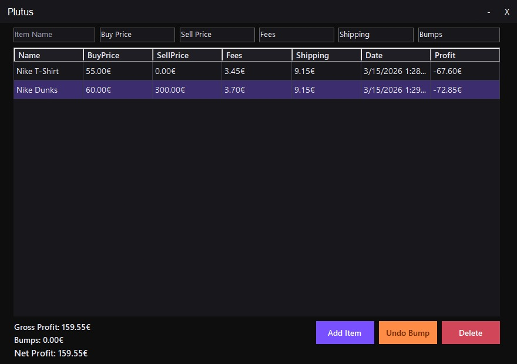

# Plutus

Plutus is an open-source WinForms desktop app for resellers to track sales, fees, shipping costs, bumps, and real net profit.

## Features

- Add and delete resell items
- Track buy price, sell price, fees, and shipping
- Automatically calculate profit per item
- Track bumps separately
- Undo the last bump
- View gross profit, bumps, and net profit
- Simple desktop UI for quick daily use

## Why I made this

I wanted a simple desktop app that I could open quickly whenever I made a sale, instead of using spreadsheets or notes.

## Screenshots

## AI Disclaimer

This project was **heavily built with AI assistance**.

## How to run

1. Download .RAR from releases
2. Unzip it
3. Run Plutus.exe

## License

MIT
